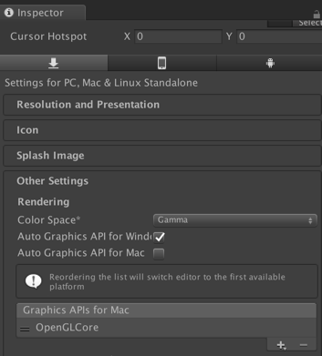

# unity-webview

unity-webview is a plugin for Unity 5 that overlays WebView components
on Unity view. It works on Android, iOS, Unity Web Player, and Mac
(Windows is not supported for now).

unity-webview is derived from keijiro-san's
https://github.com/keijiro/unity-webview-integration .

## Sample Project

It is placed under `sample/`. You can open it and import the plugin as
below:

1. Open `sample/Assets/Sample.unity`.
2. Open `dist/unity-webview.unitypackage` and import all files. It
   might be easier to extract `dist/unity-webview.zip` instead if
   you've imported unity-webview before.

## Platform Specific Notes

### Mac (Editor)

#### Auto Graphics API

The current implementation reiles on several OpenGL APIs so you need to disable "Auto graphics API"
and specify OpenGLCore as below.



#### App Transport Security

Since Unity 5.3.0, Unity.app is built with ATS (App Transport
Security) enabled and non-secured connection (HTTP) is not
permitted. If you want to open `http://foo/bar.html` with this plugin
on Unity Mac Editor, you need to open
`/Applications/Unity5.3.4p3/Unity.app/Contents/Info.plist` with a text
editor and add the following,

```diff
--- Info.plist~	2016-04-11 18:29:25.000000000 +0900
+++ Info.plist	2016-04-15 16:17:28.000000000 +0900
@@ -57,5 +57,10 @@
 	<string>EditorApplicationPrincipalClass</string>
 	<key>UnityBuildNumber</key>
 	<string>b902ad490cea</string>
+	<key>NSAppTransportSecurity</key>
+	<dict>
+		<key>NSAllowsArbitraryLoads</key>
+		<true/>
+	</dict>
 </dict>
 </plist>
```

or invoke the following from your terminal,

```bash
/usr/libexec/PlistBuddy -c "Add NSAppTransportSecurity:NSAllowsArbitraryLoads bool true" /Applications/Unity/Unity.app/Contents/Info.plist
```

##### References

* https://github.com/gree/unity-webview/issues/64
* https://onevcat.zendesk.com/hc/en-us/articles/215527307-I-cannot-open-the-web-page-in-Unity-Editor-

#### WebViewSeparated.bundle

WebViewSeparated.bundle is a variation of WebView.bundle. It is based
on https://github.com/gree/unity-webview/pull/161 . As noted in the
pull-request, it shows a separate window and allows a developer to
utilize the Safari debugger. For enabling it, please define
`WEBVIEW_SEPARATED`.

### iOS

The implementation now supports WKWebView but it is disabled by
default. For enabling it, please set enableWKWebView as below:

```csharp
        webViewObject = (new GameObject("WebViewObject")).AddComponent<WebViewObject>();
        webViewObject.Init(
            ...
            enableWKWebView: true);
```
(cf. https://github.com/gree/unity-webview/blob/de9a25c0ab0622b15c15ecbc0c7cd85858aa7745/sample/Assets/Scripts/SampleWebView.cs#L94)

Please also note that this flag have no effect on platforms without WKWebView (such as iOS7 and
Android).

### Android

*NOTE: the following steps are now performed by Assets/Plugins/Android/Editor/UnityWebViewPostprocessBuild.cs.*

Once you built an apk, please copy
`sample/Temp/StatingArea/AndroidManifest-main.xml` to
`sample/Assets/Plugins/Android/AndroidManifest.xml`, edit the latter to add
`android:hardwareAccelerated="true"` to `<activity
android:name="com.unity3d.player.UnityPlayerActivity" ...`, and
rebuilt the apk. Although some old/buggy devices may not work well
with `android:hardwareAccelerated="true"`, the WebView runs very
smoothly with this setting.

*NOTE: Unity 5.6.1p4 or newer (including 2017 1.0) seems to fix the issue. cf. https://github.com/gree/unity-webview/pull/212#issuecomment-314952793*

For Unity 5.6.0 and 5.6.1 (except 5.6.1p4), you also need to modify `android:name` from
`com.unity3d.player.UnityPlayerActivity` to
`net.gree.unitywebview.CUnityPlayerActivity`. This custom activity
implementation will adjust Unity's SurfaceView z order. Please refer
`plugins/Android/src/net/gree/unitywebview/CUnityPlayerActivity.java`
and `plugins/Android/src/net/gree/unitywebview/CUnityPlayer.java` if
you already have your own activity implementation.

#### How to build WebViewPlugin.jar

The following steps are for Mac but you can follow similar ones for Windows.

1. Install [Android Studio](https://developer.android.com/studio/install).
2. Open Android Studio and select "Configure/SDK Manager", select the followings with "Show Package Details",
   and click OK.
  * SDK Platforms
    * Android 6.0 (Marshmallow)
      * Android SDK Platform 23
  * SDK Tools
    * Android SDK Build Tools
      * 28.0.2
3. Open Terminal.app and perform the followings. You should find
   `unity-webview/build/Packager/Assets/Plugins/Android/WebViewPlugin.jar` if successful.

```bash
$ export ANDROID_HOME=~/Library/Android/sdk
$ export PATH=$PATH:~/Library/Android/sdk/platform-tools/bin:~/Library/Android/sdk/tools:~/Library/Android/sdk/tools/bin
$ cd unity-webview/plugins/Android
$ ./install.sh
```

### Web Player

The implementation utilizes IFRAME so please put both
"an\_unityplayer\_page.html" and "a\_page\_loaded\_in\_webview.html"
should be placed on the same domain for avoiding cross-domain
requests.
