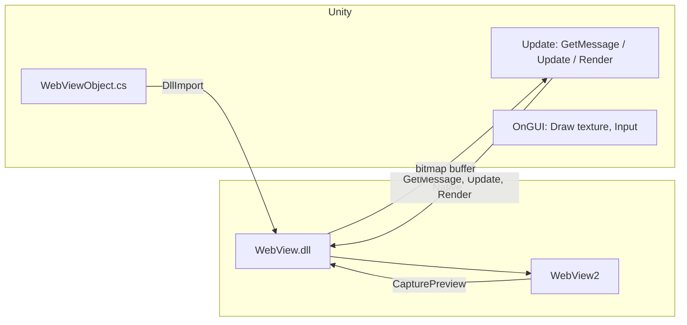

# Unity WebView Plugin — Windows Platform Support Plan

## Current Project Summary

- **Supported**: Android (Java/AAR), iOS (WKWebView .mm), Mac Editor/Standalone (WebView.bundle + WKWebView), WebGL (jslib).
- **Not supported**: Windows / Linux / Server — In [plugins/WebViewObject.cs](plugins/WebViewObject.cs), all `UNITY_EDITOR_WIN || UNITY_STANDALONE_WIN` branches only output errors or empty stubs (30+ places).
- **Mac implementation pattern**: Native bundle exports C functions (`_CWebViewPlugin_Init`, `LoadURL`, `GetMessage`, `Update`, `Render`, etc.); C# calls them via `[DllImport("WebView")]`. Offscreen WKWebView uses `takeSnapshotWithConfiguration` to obtain a bitmap, written into a Unity-provided buffer and drawn in `OnGUI` with mouse/keyboard handling.

---

## Technical Approach: WebView2 + C API Aligned with Mac

- **Backend**: Microsoft **WebView2** (Edge Chromium), the recommended option for Windows 10+, with [CapturePreview](https://learn.microsoft.com/en-us/microsoft-edge/webview2/reference/win32/icorewebview2#capturepreview) for bitmap capture, matching the existing “offscreen render → composite in Unity” flow.
- **Interface**: Add a **Windows-only C++ Win32 DLL** exporting the same C function names and signatures as Mac (or as close as possible), so [WebViewObject.cs](plugins/WebViewObject.cs) can use the same `#elif UNITY_STANDALONE_WIN` / `UNITY_EDITOR_WIN` logic with only the DllImport library name changed to the Windows DLL (e.g. `"WebView"` or `"WebViewPlugin"`).
- **Reference**: The open-source [UnityWebView2](https://github.com/umetaman/UnityWebView2) project can be used as a reference for WebView2 + Unity integration; this project must additionally align the C API and message formats (e.g. `CallFromJS`, `CallOnLoaded`) with existing behavior on Android/iOS/Mac.

---

## Architecture and Data Flow (Concept)

- Each frame Unity: `GetMessage` retrieves queued messages from native (JS calls, load complete, etc.); `Update(..., refreshBitmap, dpr)` drives capture; `Render` writes pixels into the C#-provided `byte[]`; `OnGUI` draws the texture and forwards mouse/keyboard events to native.

---

## Implementation Items

### 1. Windows Native Plugin (C++ Win32 DLL)

- **Location**: New directory, e.g. `plugins/Windows/` (or `plugins/Win/`), containing the Visual Studio project and source.
- **Dependencies**: [WebView2 SDK](https://learn.microsoft.com/en-us/microsoft-edge/webview2/) (C++, via NuGet or manual use of `WebView2.h` / `WebView2Loader.dll`, etc.).
- **C API to implement** (aligned with [plugins/Mac/Sources/WebView.mm](plugins/Mac/Sources/WebView.mm) `extern "C"`):
  - Required: `_CWebViewPlugin_Init`, `_CWebViewPlugin_Destroy`, `_CWebViewPlugin_SetRect`, `_CWebViewPlugin_SetVisibility`, `_CWebViewPlugin_LoadURL`, `_CWebViewPlugin_LoadHTML`, `_CWebViewPlugin_EvaluateJS`, `_CWebViewPlugin_Progress`, `_CWebViewPlugin_CanGoBack`, `_CWebViewPlugin_CanGoForward`, `_CWebViewPlugin_GoBack`, `_CWebViewPlugin_GoForward`, `_CWebViewPlugin_Reload`, `_CWebViewPlugin_Update`, `_CWebViewPlugin_BitmapWidth`, `_CWebViewPlugin_BitmapHeight`, `_CWebViewPlugin_Render`, `_CWebViewPlugin_GetMessage`, `_CWebViewPlugin_SendMouseEvent`, `_CWebViewPlugin_SendKeyEvent`.
  - Optional (Mac parity): `_CWebViewPlugin_GetAppPath`, `_CWebViewPlugin_InitStatic`, `_CWebViewPlugin_IsInitialized`, `_CWebViewPlugin_SetURLPattern`, `_CWebViewPlugin_AddCustomHeader`, `_CWebViewPlugin_GetCustomHeaderValue`, `_CWebViewPlugin_RemoveCustomHeader`, `_CWebViewPlugin_ClearCustomHeader`, `_CWebViewPlugin_ClearCookie`, `_CWebViewPlugin_ClearCookies`, `_CWebViewPlugin_SaveCookies`, `_CWebViewPlugin_GetCookies`.
- **Implementation notes**:
  - Use a **hidden window** to host `CoreWebView2` so loading and JS execution work without a visible window.
  - When appropriate (e.g. `Update(refreshBitmap=true)`), call WebView2 **CapturePreview** and write the result into the buffer used by `Render(instance, textureBuffer)` (RGBA format must match Mac/Unity).
  - Message queue: On WebView2 navigation/load complete and JS `postMessage` etc., push strings in the existing format (e.g. `"CallFromJS:..."`, `"CallOnLoaded:..."`) for C# `GetMessage` to poll.
  - **Threading**: WebView2 requires STA and a message pump; if the Unity main thread is not STA, create a dedicated STA thread and hidden window inside the DLL and use PostMessage/synchronization to communicate with the caller and avoid deadlocks.
- **Output**: Build produces `WebView.dll` (or `WebViewPlugin.dll`) for Unity’s `Assets/Plugins/x86_64/` (64-bit); add `x86` if 32-bit is needed.

### 2. C# Changes (WebViewObject.cs)

- **File**: [plugins/WebViewObject.cs](plugins/WebViewObject.cs) (after edits, sync to dist/package and dist/package-nofragment, or rely on existing build copy).
- **Approach**:
  - Replace all current `//TODO: UNSUPPORTED` `#elif UNITY_EDITOR_WIN || UNITY_STANDALONE_WIN` (and separate `UNITY_EDITOR_LINUX || UNITY_SERVER` if needed so only Windows is enabled) with **real implementations**.
  - Add `#elif UNITY_EDITOR_WIN || UNITY_STANDALONE_WIN` blocks:
    - Declare the same DllImports as Mac (library name changed to `"WebView"` or the actual DLL name) and the same members (e.g. `IntPtr webView`, `Rect rect`, `Texture2D texture`, `byte[] textureDataBuffer`).
    - `Init`: Call `_CWebViewPlugin_InitStatic` (Windows can be a no-op), `_CWebViewPlugin_Init`, and set `rect`.
    - `SetMargins` / `SetCenterPositionWithScale`: After conversion, call `_CWebViewPlugin_SetRect`.
    - `SetVisibility`, `LoadURL`, `LoadHTML`, `EvaluateJS`, `GoBack`, `GoForward`, `Reload`, `SetURLPattern`, Cookie/Header, etc.: Forward to the corresponding C API.
    - In `Update`: Poll `_CWebViewPlugin_GetMessage` and dispatch by prefix to `CallFromJS` / `CallOnLoaded` etc.; call `_CWebViewPlugin_Update(webView, refreshBitmap, devicePixelRatio)`; when `refreshBitmap` get `BitmapWidth`/`BitmapHeight`, `Render` into `textureDataBuffer`, then `texture.LoadRawTextureData`/`Apply`.
    - In `OnGUI`: Handle mouse/keyboard and call `_CWebViewPlugin_SendMouseEvent` / `_CWebViewPlugin_SendKeyEvent`, and draw the texture with `Graphics.DrawTexture` (reuse Mac’s coordinate transform if applicable).
  - Mac-only `_CWebViewPlugin_GetAppPath` can return a fixed string or empty on Windows; `InitStatic` can be a no-op on Windows.
- **Conditional compilation**: Keep `UNITY_EDITOR_LINUX || UNITY_SERVER` unsupported; only add implementations for `UNITY_EDITOR_WIN || UNITY_STANDALONE_WIN` to avoid affecting other platforms.

### 3. Plugin Placement and meta

- **Directories**: In dist package (or via build script): `Assets/Plugins/x86_64/WebView.dll` (64-bit Windows); optionally `Assets/Plugins/x86/WebView.dll` (32-bit).
- **.meta**: Create PluginImporter for the DLL, enabling only **Editor (Windows)** and **Standalone (Windows / Win64)** for the appropriate CPU (x86 or x86_64), similar to [WebView.bundle.meta](dist/package/Assets/Plugins/WebView.bundle.meta) for Mac.

### 4. WebView2 Runtime Dependency

- **WebView2 Runtime** must be installed at run time (many Win10/11 systems have it; otherwise the user installs it).
- Optionally document the requirement in README or plugin docs, or provide guidance on [distributing a fixed Runtime with the app](https://learn.microsoft.com/en-us/microsoft-edge/webview2/concepts/distribution).

### 5. Build and Packaging

- If the project uses Rake/Packager ([build/](build/)): add steps to build the Windows DLL and copy `WebView.dll` to `dist/package/Assets/Plugins/x86_64`.
- CI or local machine must have Visual Studio with C++ desktop development to build the DLL.

### 6. Documentation and README

- Add a **Windows** section under “Platform-Specific Notes” in [README.md](README.md): Editor and Standalone support, WebView2 Runtime requirement, and any 32/64 or permission notes.
- Change the opening “Windows is not supported” to state that Windows (Editor + Standalone) is supported.

---

## Risks and Considerations

- **Threading and COM**: WebView2’s COM and UI thread requirements are strict; the DLL must handle STA and message pump correctly or crashes/hangs are likely.
- **CapturePreview performance**: Per-frame capture can be costly; use `bitmapRefreshCycle` (e.g. capture every N frames) as on Mac.
- **First-run experience**: If WebView2 Runtime is missing, provide a clear error or link to the download page; consider detecting DLL load failure in C# and prompting.

---

## Suggested Implementation Order

1. Create the `plugins/Windows/` project and implement the minimal C API (Init, Destroy, SetRect, LoadURL, GetMessage, Update, Render, mouse/keyboard) with a hidden window and CapturePreview for the bitmap.
2. Add `UNITY_EDITOR_WIN || UNITY_STANDALONE_WIN` DllImport and Init/Update/OnGUI logic in WebViewObject.cs; skip Cookie/Header and other advanced APIs initially.
3. Test basic load, JS interop, and input in Unity Editor (Windows) and Standalone builds.
4. Complete the remaining C API (Cookie, CustomHeader, URL pattern, etc.) and corresponding C# branches.
5. Integrate into the build process, update README, and add WebView2 Runtime detection or instructions if needed.

---

## Post-Implementation Fixes and Additions (Incorporated)

The following fixes and additions were made during implementation and debugging and are reflected in the code and docs.

### Mouse and Keyboard Input

- **Issue**: With the standard `CreateCoreWebView2Controller` and `SendMessage(WM_LBUTTONDOWN`, etc.) to `Chrome_WidgetWin_0`, Chromium ignores synthetic messages, so link clicks, text selection, and input focus did not work.
- **Approach**: Switch to **CreateCoreWebView2CompositionController** (requires `ICoreWebView2Environment3`). After obtaining `ICoreWebView2CompositionController`, forward mouse via **SendMouseInput** (`COREWEBVIEW2_MOUSE_EVENT_KIND_MOVE` / `LEFT_BUTTON_DOWN` / `LEFT_BUTTON_UP` / `WHEEL`) with client-area coordinates (Y flipped to match Unity). Keyboard continues to be sent to the host hwnd (or child) via `WM_CHAR` / `WM_KEYDOWN` / `WM_KEYUP`.
- **Result**: Left-click navigation, text selection, and keyboard input in form fields work correctly.

### Performance and Capture Rate

- **CapturePreview** is costly; default to capturing every N frames (C# `bitmapRefreshCycle`; on Windows a default of 3–10 balances FPS and smoothness). Document the setting in README.

### Data Directory and Permissions

- WebView2 `userDataFolder` must not be on a read-only path (e.g. under Program Files). Use `%LOCALAPPDATA%\UnityWebView2`, falling back to the executable directory if needed.

### Host Window and Input

- Make the host window “visible but off-screen” (e.g. `SetWindowPos(..., -32000, -32000)` + `ShowWindow(SW_SHOWNOACTIVATE)`) to avoid input quirks when fully hidden; mouse is still handled via CompositionController’s SendMouseInput.

### Lambda Capture Build Error

- In the completion callback of `CreateCoreWebView2EnvironmentWithOptions`, using the outer variable `hr` for the result of `env->QueryInterface(IID_PPV_ARGS(&env3))` causes C3493/C2326 because the lambda does not capture it. Use a local variable (e.g. `HRESULT hrQI`) inside the lambda for the QueryInterface result.

### Debug Logging

- The plugin has `OutputDebugString` logging (`WV_LOG`) controlled by **WEBVIEW_DEBUG** at the top of `WebViewPlugin.cpp` (default **0** = off). Set to 1 and rebuild to inspect mouse/keyboard and window info via DebugView or Visual Studio output when debugging input. See the “Debug logging” section in `plugins/Windows/README.md`.

### 32-bit (x86) Platform Build Support

- **Issue**: In the manually created C++ project files (`.vcxproj` and `.sln`), the 32-bit platform was mistakenly named `x86`. However, Visual Studio and MSBuild strictly require the 32-bit platform identifier in C++ projects to be **`Win32`**, causing build errors for the 32-bit version (e.g., `Project does not contain a configuration and platform combination of Release|Win32`).
- **Approach**: Replaced all instances of `x86` with `Win32` in `WebViewPlugin.vcxproj` and `WebViewPlugin.sln`.
- **Result**: You can now successfully select the `Win32` platform in Visual Studio to build. The resulting 32-bit `WebView.dll` should be placed in the `Assets/Plugins/x86/` directory of your Unity project to support 32-bit Windows applications.

### Hide Taskbar Icon

- **Issue**: When running the Unity project, a blank, unnamed application icon would appear on the Windows taskbar. This was because the hidden window hosting WebView2 was created with the default `WS_OVERLAPPEDWINDOW` style.
- **Approach**: In the `CreateWindowExW` call within `WebViewPlugin.cpp`, changed the window style to `WS_POPUP` and added the extended style `WS_EX_TOOLWINDOW`.
- **Result**: The hidden window no longer shows up on the Windows taskbar, and it does not affect WebView2's offscreen rendering or input forwarding.

### GetMessage return buffer: CoTaskMemAlloc

- **Issue**: `_CWebViewPlugin_GetMessage` returned a string buffer allocated with `malloc()`. For P/Invoke, the .NET/Mono runtime expects to free such buffers with `Marshal.FreeCoTaskMem` (i.e. `CoTaskMemFree()`); mixing allocators can cause leaks or undefined behavior.
- **Approach**: Allocate the message buffer with `CoTaskMemAlloc()` (include `<objbase.h>`, link `ole32.lib`). The marshaller then frees it with `CoTaskMemFree()` when marshalling the returned `const char*` to a C# string.
- **Reference**: [Mono P/Invoke](https://www.mono-project.com/docs/advanced/pinvoke/) — memory passed across the managed/unmanaged boundary should use the runtime’s allocator (on Windows, the COM task memory allocator).

### Destroy race: wait for STA cleanup before freeing instance

- **Issue**: In `_CWebViewPlugin_Destroy`, the code posted `WM_WEBVIEW_DESTROY` to the STA thread and then immediately erased the `WebViewInstance` from `s_instances`, freeing the object. The STA thread could still be accessing `inst` (e.g. in the WndProc when handling `WM_WEBVIEW_DESTROY`), leading to use-after-free and intermittent crashes on app exit.
- **Approach**: Create a “destroy done” event; pass it as `lParam` when posting `WM_WEBVIEW_DESTROY`. In the WndProc, after releasing COM references and closing handles, call `SetEvent(destroyDoneEvent)` and then `DestroyWindow(hwnd)`. In `_CWebViewPlugin_Destroy`, call `WaitForSingleObject(destroyDoneEvent, 10000)` before erasing the instance from `s_instances` and closing the event handle.
- **Result**: The instance is only destroyed after the STA thread has finished all cleanup, eliminating the use-after-free and the associated exit crash.

### Non-blocking capture and double-buffering (avoid blocking main thread)

- **Issue**: `_CWebViewPlugin_Update` previously created an event, posted `WM_WEBVIEW_CAPTURE` to the STA thread, and then called `WaitForSingleObject(ev, 5000)`, blocking the main (Unity) thread for up to 5 seconds per frame when `refreshBitmap` was true.
- **Approach**:
  - **Non-blocking**: Start a new capture only when none is in progress. The main thread uses a `captureInProgress` flag (`std::atomic<bool>`): only when `!captureInProgress.exchange(true)` does it call `PostMessage(inst->hwnd, WM_WEBVIEW_CAPTURE, 0, 0)`; no event is created or passed, and `WaitForSingleObject` is removed. `captureInProgress` is set back to `false` in the STA thread's CapturePreview completion callback, and also in the `WM_WEBVIEW_CAPTURE` handler when `!inst || !inst->webview`.
  - **Double-buffering**: Add a back buffer in `WebViewInstance` (`bitmapPixelsBack`, `bitmapWidthBack`, `bitmapHeightBack`). After CapturePreview completes on the STA thread, decode into a local buffer, write into `bitmapPixelsBack`, then under `bitmapMutex` swap with `bitmapPixels` and update width/height. `_CWebViewPlugin_Render` always reads only the front buffer `bitmapPixels`, so it never waits on capture and never sees a half-updated buffer.
- **Result**: The main thread no longer blocks on capture; Render reads only the current front buffer, consistent with the macOS double-buffering approach.

---

## Blocking-point review (other possible causes of “stuck when opening page”)

Findings for cases where the page has loaded but the app still feels stuck.

### 1. Init blocking (most likely cause)

- **Location**: Inside `_CWebViewPlugin_Init`, `WaitForSingleObject(params.readyEvent, 30000)` (around line 655).
- **Behavior**: When creating the WebView, the main thread **synchronously waits** for the STA thread to complete the **asynchronous** callbacks of `CreateCoreWebView2EnvironmentWithOptions` and `CreateCoreWebView2CompositionController`, for up to **30 seconds**. On a slow system, first-run WebView2, or under antivirus/network delay, initialization can take several seconds, during which the **Unity main thread is fully blocked** and the app appears stuck when “opening the page.”
- **Recommendation**:
  - The timeout has been reduced from 30 seconds to **10 seconds** so that on failure or slow init the main thread does not stay blocked as long.
  - To avoid blocking entirely, Init could be made asynchronous: the C API returns immediately with a “pending” instance, and C# polls `IsInitialized` in Update or uses a callback before calling LoadURL, etc. (larger change).

### 2. Destroy blocking

- **Location**: Inside `_CWebViewPlugin_Destroy`, `WaitForSingleObject(destroyDoneEvent, 10000)` (around line 680).
- **Behavior**: On close, the main thread waits up to 10 seconds for STA cleanup. This only affects shutdown, not “opening” or “loading.”

### 3. PostToInstanceAndWait

- **Status**: **Not used** anywhere in the code; only defined. Does not cause blocking.

### 4. Mutex contention (BitmapWidth / BitmapHeight / Render)

- **Behavior**: The main thread takes `bitmapMutex` when calling `BitmapWidth`, `BitmapHeight`, and `Render` each frame. With double-buffering, the STA thread holds the lock only briefly during the swap; decoding is done outside the lock, so contention is minimal and should not cause noticeable stutter.

### Summary

- **“Stuck when opening the page”** is most likely due to **Init’s synchronous wait** (formerly up to 30 seconds). The timeout has been reduced to 10 seconds to limit the impact.
- Capture-related blocking has been removed by non-blocking capture and double-buffering.
- Other blocking (Destroy, unused PostToInstanceAndWait, brief mutex) should not explain the app feeling stuck after load.
