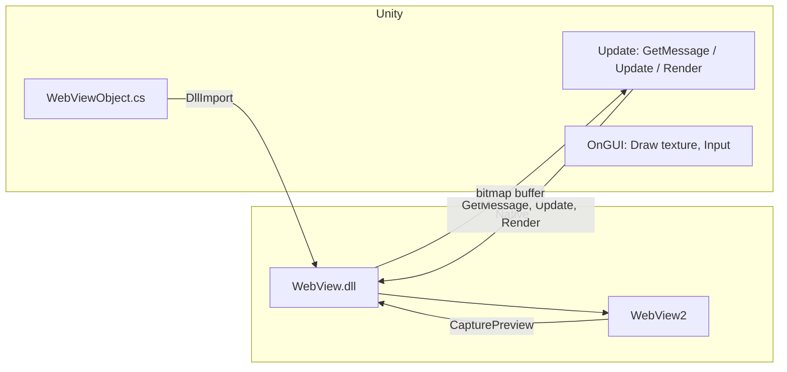

# Unity WebView 插件 — Windows 平台支援計劃

## 專案現況摘要

- **已支援**: Android（Java/AAR）、iOS（WKWebView .mm）、Mac Editor/Standalone（WebView.bundle + WKWebView）、WebGL（jslib）。
- **未支援**: Windows / Linux / Server — 在 [plugins/WebViewObject.cs](plugins/WebViewObject.cs) 中，所有 `UNITY_EDITOR_WIN || UNITY_STANDALONE_WIN` 分支僅輸出錯誤或空實作（約 30+ 處）。
- **Mac 實作模式**: 原生 bundle 匯出 C 函式（`_CWebViewPlugin_Init`, `LoadURL`, `GetMessage`, `Update`, `Render` 等），C# 以 `[DllImport("WebView")]` 呼叫；離屏 WKWebView 以 `takeSnapshotWithConfiguration` 取得點陣圖，寫入 Unity 提供的 buffer，由 Unity 在 `OnGUI` 繪製並處理滑鼠/鍵盤。

---

## 技術方案：採用 WebView2 + 與 Mac 對齊的 C API

- **後端**: Microsoft **WebView2**（Edge Chromium），Windows 10+ 建議方案，且具 [CapturePreview](https://learn.microsoft.com/en-us/microsoft-edge/webview2/reference/win32/icorewebview2#capturepreview) 可取得 bitmap，適合與現有「離屏渲染 → 貼到 Unity」流程一致。
- **介面**: 新增 **Windows 專用 C++ Win32 DLL**，匯出與 Mac 相同的 C 函式名稱與簽名（或盡量一致），以便在 [WebViewObject.cs](plugins/WebViewObject.cs) 用同一套 `#elif UNITY_STANDALONE_WIN` / `UNITY_EDITOR_WIN` 邏輯，僅 DllImport 的 library 名稱改為 Windows 的 DLL（例如 `"WebView"` 或 `"WebViewPlugin"`）。
- **參考**: 開源專案 [UnityWebView2](https://github.com/umetaman/UnityWebView2) 可作為 WebView2 與 Unity 整合的參考；本專案則需額外對齊現有 C API 與訊息格式（如 `CallFromJS`, `CallOnLoaded` 等），以保持與 Android/iOS/Mac 行為一致。

---

## 架構與資料流（概念）

- Unity 每幀：`GetMessage` 取回原生層排隊的訊息（JS 呼叫、載入完成等）；`Update(..., refreshBitmap, dpr)` 驅動擷圖；`Render` 將像素寫入 C# 提供的 `byte[]`；`OnGUI` 用該 texture 繪製並轉發滑鼠/鍵盤事件到原生。

---

## 實作項目

### 1. Windows 原生插件（C++ Win32 DLL）

- **位置**: 新增目錄，例如 `plugins/Windows/`（或 `plugins/Win/`），內含 Visual Studio 專案與原始碼。
- **依賴**: [WebView2 SDK](https://learn.microsoft.com/en-us/microsoft-edge/webview2/)（C++，NuGet 或手動取用 `WebView2.h` / `WebView2Loader.dll` 等）。
- **需實作的 C API**（與 [plugins/Mac/Sources/WebView.mm](plugins/Mac/Sources/WebView.mm) 的 `extern "C"` 對齊）:
  - 必要：`_CWebViewPlugin_Init`, `_CWebViewPlugin_Destroy`, `_CWebViewPlugin_SetRect`, `_CWebViewPlugin_SetVisibility`, `_CWebViewPlugin_LoadURL`, `_CWebViewPlugin_LoadHTML`, `_CWebViewPlugin_EvaluateJS`, `_CWebViewPlugin_Progress`, `_CWebViewPlugin_CanGoBack`, `_CWebViewPlugin_CanGoForward`, `_CWebViewPlugin_GoBack`, `_CWebViewPlugin_GoForward`, `_CWebViewPlugin_Reload`, `_CWebViewPlugin_Update`, `_CWebViewPlugin_BitmapWidth`, `_CWebViewPlugin_BitmapHeight`, `_CWebViewPlugin_Render`, `_CWebViewPlugin_GetMessage`, `_CWebViewPlugin_SendMouseEvent`, `_CWebViewPlugin_SendKeyEvent`.
  - 可選（與 Mac 一致）：`_CWebViewPlugin_GetAppPath`, `_CWebViewPlugin_InitStatic`, `_CWebViewPlugin_IsInitialized`, `_CWebViewPlugin_SetURLPattern`, `_CWebViewPlugin_AddCustomHeader`, `_CWebViewPlugin_GetCustomHeaderValue`, `_CWebViewPlugin_RemoveCustomHeader`, `_CWebViewPlugin_ClearCustomHeader`, `_CWebViewPlugin_ClearCookie`, `_CWebViewPlugin_ClearCookies`, `_CWebViewPlugin_SaveCookies`, `_CWebViewPlugin_GetCookies`。
- **實作要點**:
  - 使用**隱藏視窗**承載 `CoreWebView2`，以便在無可見視窗時仍能載入與執行 JS。
  - 在適當時機（例如 `Update(refreshBitmap=true)`）呼叫 WebView2 的 **CapturePreview**，將結果寫入 `Render(instance, textureBuffer)` 的 buffer（RGBA 等格式需與 Mac/Unity 一致）。
  - 訊息佇列：在 WebView2 的導覽/載入完成、JS 透過 `postMessage` 等回傳時，將字串推入佇列，格式與現有一致（例如 `"CallFromJS:..."`, `"CallOnLoaded:..."`），由 C# 的 `GetMessage` 輪詢取回。
  - **執行緒**: WebView2 需在 STA 且需 message pump；若 Unity 主線程非 STA，需在 DLL 內建立專用 STA 線程與隱藏視窗，並用 PostMessage/同步機制與呼叫端溝通，避免死鎖。
- **輸出**: 建置產出 `WebView.dll`（或 `WebViewPlugin.dll`），放置於 Unity 的 `Assets/Plugins/x86_64/`（64 位元）；若有 32 位元需求則另建 `x86`。

### 2. C# 端修改（WebViewObject.cs）

- **檔案**: [plugins/WebViewObject.cs](plugins/WebViewObject.cs)（修改後需同步至 dist/package 與 dist/package-nofragment，或由既有 build 流程拷貝）。
- **作法**:
  - 將所有目前標記為 `//TODO: UNSUPPORTED` 的 `#elif UNITY_EDITOR_WIN || UNITY_STANDALONE_WIN`（以及必要時的 `UNITY_EDITOR_LINUX || UNITY_SERVER` 分離，僅 Windows 啟用）改為**實際實作**。
  - 新增 `#elif UNITY_EDITOR_WIN || UNITY_STANDALONE_WIN` 區塊：
    - 宣告與 Mac 相同的 DllImport（library 名改為 `"WebView"` 或實際 DLL 名稱），以及與 Mac 相同的成員（如 `IntPtr webView`, `Rect rect`, `Texture2D texture`, `byte[] textureDataBuffer` 等）。
    - `Init`: 呼叫 `_CWebViewPlugin_InitStatic`（Windows 可為空實作）、`_CWebViewPlugin_Init`，並設定 `rect`。
    - `SetMargins` / `SetCenterPositionWithScale`: 換算後呼叫 `_CWebViewPlugin_SetRect`。
    - `SetVisibility`, `LoadURL`, `LoadHTML`, `EvaluateJS`, `GoBack`, `GoForward`, `Reload`, `SetURLPattern`, Cookie/Header 等：轉發至對應 C API。
    - 在 `Update` 中：輪詢 `_CWebViewPlugin_GetMessage` 並依前綴分派到 `CallFromJS` / `CallOnLoaded` 等；呼叫 `_CWebViewPlugin_Update(webView, refreshBitmap, devicePixelRatio)`；若 `refreshBitmap` 則取 `BitmapWidth`/`BitmapHeight`、`Render` 寫入 `textureDataBuffer` 並 `texture.LoadRawTextureData`/`Apply`。
    - 在 `OnGUI` 中：處理滑鼠/鍵盤事件並呼叫 `_CWebViewPlugin_SendMouseEvent` / `_CWebViewPlugin_SendKeyEvent`，以及用 `Graphics.DrawTexture` 繪製 texture（可沿用 Mac 的座標轉換）。
  - Mac 專用的 `_CWebViewPlugin_GetAppPath` 在 Windows 可回傳固定字串或空，不影響核心流程；`InitStatic` 在 Windows 可為 no-op。
- **條件編譯**: 保持 `UNITY_EDITOR_LINUX || UNITY_SERVER` 維持不支援，僅加入 `UNITY_EDITOR_WIN || UNITY_STANDALONE_WIN` 的實作，避免影響現有平台。

### 3. 插件放置與 meta

- **目錄**: 在 dist 的 package 中新增（或由 build 腳本複製）：
  - `Assets/Plugins/x86_64/WebView.dll`（64 位元 Windows）
  - 可選：`Assets/Plugins/x86/WebView.dll`（32 位元）
- **.meta**: 為上述 DLL 建立 PluginImporter，僅勾選 **Editor (Windows)** 與 **Standalone (Windows / Win64)**，對應 CPU 為 x86 或 x86_64，與現有 [WebView.bundle.meta](dist/package/Assets/Plugins/WebView.bundle.meta) 的 Mac 設定方式類似。

### 4. WebView2 Runtime 依賴

- 執行時需已安裝 **WebView2 Runtime**（多數 Win10/11 已內建，或由使用者安裝）。
- 可選：在說明文件（README 或本插件文件）中註明需求，或提供 [固定版本 Runtime 隨應用分發](https://learn.microsoft.com/en-us/microsoft-edge/webview2/concepts/distribution) 的建議。

### 5. Build 與打包流程

- 若專案有 Rake / Packager（[build/](build/)）：在打包 dist 時加入「建置 Windows DLL」與「複製 WebView.dll 到 dist/package/Assets/Plugins/x86_64」的步驟。
- 需在 CI 或本機具備 Visual Studio（含 C++ 桌面開發）以建置該 DLL。

### 6. 文件與 README

- 在 [README.md](README.md) 的「Platform-Specific Notes」中新增 **Windows** 一節：說明支援 Editor 與 Standalone、需 WebView2 Runtime、以及若有 32/64 或特殊權限需求時的注意事項。
- 將首段「Windows is not supported」改為支援 Windows（Editor + Standalone）。

---

## 風險與注意事項

- **執行緒與 COM**: WebView2 的 COM 與 UI 線程要求嚴格，需在 DLL 內妥善處理 STA 與 message pump，否則易崩潰或卡住。
- **CapturePreview 效能**: 每幀擷圖可能較耗資源，可與 Mac 一樣用 `bitmapRefreshCycle` 降頻（例如每 N 幀擷一次）。
- **首次體驗**: 若使用者未安裝 WebView2 Runtime，需有明確錯誤訊息或導向下載頁；可考慮在 C# 端偵測 DLL 載入失敗時提示。

---

## 建議實作順序

1. 建立 `plugins/Windows/` 專案，實作最小可行 C API（Init, Destroy, SetRect, LoadURL, GetMessage, Update, Render, 滑鼠/鍵盤），並用隱藏視窗 + CapturePreview 產出 bitmap。
2. 在 WebViewObject.cs 加入 `UNITY_EDITOR_WIN || UNITY_STANDALONE_WIN` 的 DllImport 與 Init/Update/OnGUI 邏輯，先不處理 Cookie/Header 等進階 API。
3. 在 Unity Editor（Windows）與 Standalone 建置中測試基本載入、JS 互通與輸入。
4. 補齊其餘 C API（Cookie、CustomHeader、URL pattern 等）與 C# 對應分支。
5. 整合至 build 流程、撰寫 README，並視需要加入 WebView2 Runtime 偵測或說明。

---

## 實作後修正與補充（已納入）

以下為實際實作與除錯過程中完成的修正與新增處理，已反映在程式與文件中。

### 滑鼠與鍵盤輸入

- **問題**: 以一般 `CreateCoreWebView2Controller` 建立視窗並用 `SendMessage(WM_LBUTTONDOWN` 等）對 `Chrome_WidgetWin_0` 送滑鼠時，Chromium 會忽略合成訊息，導致點連結、選文字、輸入框焦點無效。
- **作法**: 改為使用 **CreateCoreWebView2CompositionController**（需 `ICoreWebView2Environment3`），取得 `ICoreWebView2CompositionController` 後，滑鼠改由 **SendMouseInput** 轉發（`COREWEBVIEW2_MOUSE_EVENT_KIND_MOVE` / `LEFT_BUTTON_DOWN` / `LEFT_BUTTON_UP` / `WHEEL`），座標為 WebView 客戶區且 Y 軸與 Unity 一致需翻轉。鍵盤仍對宿主 hwnd（或子視窗）送 `WM_CHAR` / `WM_KEYDOWN` / `WM_KEYUP`。
- **結果**: 左鍵點連結可正常導覽、可選取文字；鍵盤可在輸入框輸入。

### 效能與擷圖頻率

- **CapturePreview** 較耗資源，預設改為每 N 幀擷一次（C# 端 `bitmapRefreshCycle`，Windows 預設可設為 3～10 以兼顧 FPS 與流暢度），並在 README 說明可調。

### 資料目錄與權限

- WebView2 的 `userDataFolder` 不可放在無寫入權限的路徑（例如 Program Files 下）。改為使用 `%LOCALAPPDATA%\UnityWebView2`，失敗時再退回執行檔所在目錄。

### 宿主視窗與輸入

- 宿主視窗改為「可見但移出螢幕」（例如 `SetWindowPos(..., -32000, -32000)` + `ShowWindow(SW_SHOWNOACTIVATE)`），避免完全隱藏時部分輸入行為異常；仍由 CompositionController 的 SendMouseInput 負責滑鼠。

### Lambda  capture 編譯錯誤

- 在 `CreateCoreWebView2EnvironmentWithOptions` 的完成 callback 中，對 `env->QueryInterface(IID_PPV_ARGS(&env3))` 的結果若使用外層變數 `hr`，lambda 未 capture 會導致 C3493/C2326。改為在 lambda 內宣告區域變數（例如 `HRESULT hrQI`）存放 QueryInterface 結果即可。

### Debug 日誌

- 外掛內建 `OutputDebugString` 日誌（`WV_LOG`），由 `WebViewPlugin.cpp` 頂端 **WEBVIEW_DEBUG** 控制（預設 **0** = 關閉）。設為 1 重新建置後可用 DebugView 或 Visual Studio 輸出檢視滑鼠/鍵盤與視窗資訊，方便排查輸入問題。說明見 `plugins/Windows/README.md` 的「Debug 日誌」一節。

### 32 位元 (x86) 平台建置支援

- **問題**: 最初手動建立的 C++ 專案檔 (`.vcxproj` 與 `.sln`) 中，誤將 32 位元平台命名為 `x86`，但 Visual Studio / MSBuild 在 C++ 專案中強制要求 32 位元平台代號必須為 **`Win32`**，導致建置 32 位元版本時報錯 (`未包含 Release|Win32 的組態和平台組合`)。
- **作法**: 將 `WebViewPlugin.vcxproj` 與 `WebViewPlugin.sln` 中的 `x86` 平台字眼全數修正為 `Win32`。
- **結果**: 在 Visual Studio 中可順利選擇 `Win32` 平台進行建置，產出的 32 位元 `WebView.dll` 放置於 Unity 專案的 `Assets/Plugins/x86/` 目錄下即可支援 32 位元 Windows 應用程式。

### 隱藏工作列圖示

- **問題**: 執行 Unity 專案時，Windows 工作列會多出一個沒有名稱的空白應用程式圖示。這是因為承載 WebView2 的隱藏視窗預設使用了 `WS_OVERLAPPEDWINDOW` 樣式。
- **作法**: 在 `WebViewPlugin.cpp` 的 `CreateWindowExW` 呼叫中，將視窗樣式改為 `WS_POPUP`，並加上擴充樣式 `WS_EX_TOOLWINDOW`。
- **結果**: 該隱藏視窗不再顯示於 Windows 工作列上，且不影響 WebView2 的離屏渲染與輸入轉發。

### GetMessage 回傳緩衝區：CoTaskMemAlloc

- **問題**: `_CWebViewPlugin_GetMessage` 回傳的字串緩衝區原先以 `malloc()` 配置。在 P/Invoke 下，.NET/Mono 執行期預期以 `Marshal.FreeCoTaskMem`（即 `CoTaskMemFree()`）釋放這類緩衝區；混用不同配置器可能造成洩漏或未定義行為。
- **作法**: 改以 `CoTaskMemAlloc()` 配置訊息緩衝區（需 include `<objbase.h>`、連結 `ole32.lib`）。marshaller 在將回傳的 `const char*` 轉成 C# 字串時會以 `CoTaskMemFree()` 釋放。
- **參考**: [Mono P/Invoke](https://www.mono-project.com/docs/advanced/pinvoke/) — 跨越 managed/unmanaged 邊界的記憶體應使用執行期配置器（Windows 上為 COM task memory allocator）。

### Destroy 競態：等 STA 清理完再釋放 instance

- **問題**: 在 `_CWebViewPlugin_Destroy` 中，程式對 STA 執行緒送出 `WM_WEBVIEW_DESTROY` 後，立即從 `s_instances` 移除並釋放 `WebViewInstance`。此時 STA 執行緒仍可能正在存取 `inst`（例如在 WndProc 處理 `WM_WEBVIEW_DESTROY` 時），造成 use-after-free 與關閉應用時偶發崩潰。
- **作法**: 建立「清理完成」事件，並在 PostMessage 送出 `WM_WEBVIEW_DESTROY` 時以 `lParam` 傳入。WndProc 中在釋放 COM 參考、關閉 handle 後呼叫 `SetEvent(destroyDoneEvent)`，再呼叫 `DestroyWindow(hwnd)`。在 `_CWebViewPlugin_Destroy` 中先以 `WaitForSingleObject(destroyDoneEvent, 10000)` 等待，再從 `s_instances` 移除 instance 並關閉事件 handle。
- **結果**: 僅在 STA 執行緒完成所有清理後才釋放 instance，消除 use-after-free 與關閉時的崩潰。

### 非阻塞擷圖與雙緩衝（避免主線程阻塞）

- **問題**: `_CWebViewPlugin_Update` 原先在 `refreshBitmap` 時建立 Event、對 STA 送出 `WM_WEBVIEW_CAPTURE` 後以 `WaitForSingleObject(ev, 5000)` 等待，導致主線程（Unity）每幀可能阻塞最多 5 秒。
- **作法**:
  - **非阻塞**: 僅在「目前沒有擷取在進行」時才發送一次擷取：主線程以 `captureInProgress`（`std::atomic<bool>`）為旗標，若 `!captureInProgress.exchange(true)` 才 `PostMessage(inst->hwnd, WM_WEBVIEW_CAPTURE, 0, 0)`；不再建立／傳遞 Event，也不呼叫 `WaitForSingleObject`。`captureInProgress` 在 STA 的 CapturePreview 完成 callback 中設回 `false`；若 `WM_WEBVIEW_CAPTURE` 開頭發現 `!inst || !inst->webview` 也設回 `false`。
  - **雙緩衝**: 在 `WebViewInstance` 中新增後端緩衝 `bitmapPixelsBack`、`bitmapWidthBack`、`bitmapHeightBack`。STA 的 CapturePreview 完成後，先解碼到區域緩衝再寫入 `bitmapPixelsBack`，然後在 `bitmapMutex` 下與 `bitmapPixels` 做 swap（及同步 width/height），使 `_CWebViewPlugin_Render` 始終只讀取前端的 `bitmapPixels`，無需等待擷取完成且不會讀到半寫入狀態。
- **結果**: 主線程不再因擷圖而阻塞；Render 僅讀取當前已交換好的前端 buffer，與 macOS 的雙緩衝做法一致。
